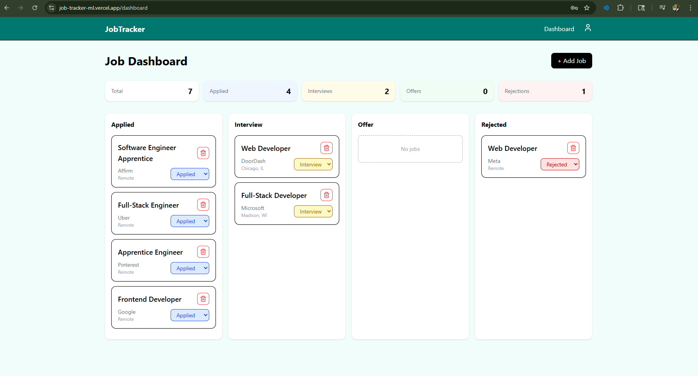

# JobTracker

A full stack web application for organizing and tracking job applications during a job search. Built with Next.js, Prisma, Supabase, and NextAuth.

🔗 **[Live Demo](https://job-tracker-ml.vercel.app/)**

---

## Screenshot

****

## Features

- **Kanban-style dashboard** — applications organized into Applied, Interview, Offer, and Rejected columns
- **Full CRUD** — add, update, and delete job applications
- **Inline status updates** — change application status directly from the job card
- **Job detail modal** — view appication details and edit notes
- **Authentication** — secure user registration and login with hashed passwords
- **Per-user data** — each user only sees their own applications
- **Stats bar** — at-a-glance counts of total applications, interviews, offers, and rejections
- **Persistent storage** — data saved to a hosted PostgreSQL database via Supabase
- **WCAG AA accessibility** — semantic HTML, keyboard navigation, focus management, screen reader support, and ARIA attributes throughout
- **Smooth animations** — page transitions and interactions powered by Framer Motion

---

## Tech Stack

| Layer | Technology |
|---|---|
| Framework | [Next.js 16](https://nextjs.org/) (App Router) |
| Language | JavaScript |
| Styling | [Tailwind CSS v4](https://tailwindcss.com/) |
| Database | [Supabase](https://supabase.com/) (PostgreSQL) |
| ORM | [Prisma](https://www.prisma.io/) |
| Auth | [NextAuth v5](https://authjs.dev/) (Credentials) |
| Animations | [Framer Motion](https://www.framer.com/motion/) |
| Icons | [Lucide React](https://lucide.dev/) |
| Deployment | [Vercel](https://vercel.com/) |

---

## Getting Started

### Prerequisites
- Node.js 18+
- A [Supabase](https://supabase.com/) account (free tier works)

### Installation

1. **Clone the repo**
   ```bash
   git clone https://github.com/makennalehnert/job-tracker.git
   cd job-tracker/client
   ```

2. **Install dependencies**
   ```bash
   npm install
   ```

3. **Set up environment variables**

   Create a `.env` file in the `client/` directory:
   ```env
   DATABASE_URL="your_supabase_pooler_url"
   DIRECT_URL="your_supabase_direct_url"
   AUTH_SECRET="your_nextauth_secret"
   ```

   Generate an `AUTH_SECRET` with:
   ```bash
   node -e "console.log(require('crypto').randomBytes(32).toString('hex'))"
   ```

4. **Push the database schema**
   ```bash
   npx prisma db push
   npx prisma generate
   ```

5. **Run the development server**
   ```bash
   npm run dev
   ```

   Open [http://localhost:3000](http://localhost:3000) in your browser.

---

## Database Schema

```prisma
model User {
  id        Int      @id @default(autoincrement())
  email     String   @unique
  password  String
  createdAt DateTime @default(now())
  jobs      Job[]
}

model Job {
  id          Int      @id @default(autoincrement())
  company     String
  role        String
  status      String   @default("Applied")
  location    String?
  notes       String?
  dateApplied DateTime @default(now())
  createdAt   DateTime @default(now())
  userId      Int
  user        User     @relation(fields: [userId], references: [id])
}
```

---

## Architecture

This project follows Next.js App Router conventions with a clear separation between client and server:

- **`/src/app/api/`** — REST API routes (jobs CRUD, user registration) using Next.js Route Handlers
- **`/src/app/dashboard/`** — client-side kanban board with optimistic UI updates
- **`/src/app/login/` & `/register/`** — authentication pages
- **`/src/components/`** — reusable UI components (Column, JobCard, Navbar, UserMenu)
- **`/src/lib/prisma.js`** — Prisma client singleton to prevent connection leaks in development
- **`/src/auth.js`** — NextAuth configuration with JWT sessions and bcrypt password hashing
- **`/src/proxy.js`** — Next.js middleware to protect authenticated routes

---

## Security

- Passwords hashed with **bcryptjs** before storage — plaintext passwords are never saved
- Minimum password length enforced on registration
- API routes protected with **NextAuth session checks** — unauthenticated requests return 401
- Jobs scoped to `userId` — users cannot access or modify other users' data
- Prisma uses **parameterized queries** — protected against SQL injection
- Environment variables used for all secrets — nothing sensitive committed to the repository

---

## Accessibility

This project targets **WCAG 2.1 AA** compliance:

- Semantic HTML landmarks (`<nav>`, `<main>`, `<section>`, `<dl>`)
- All interactive elements have accessible names via `aria-label` or associated `<label>`
- Keyboard navigation supported throughout — modals trap focus and close on Escape
- `aria-live` regions announce dynamic content changes to screen readers
- Visible focus indicators on all interactive elements
- Skip to main content link for keyboard users
- Icon-only buttons have screen-reader text

---

## Roadmap

- [ ] Drag and drop between kanban columns
- [ ] Edit job details (company, role, location)
- [ ] Filter and search applications
- [ ] Date applied picker
- [ ] Toast notifications

---

## Author

**Makenna Lehnert**

- GitHub: [@makennalehnert](https://github.com/makennalehnert)
- LinkedIn: (https://www.linkedin.com/in/makenna-lehnert)
